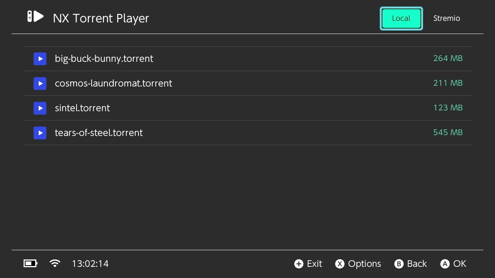
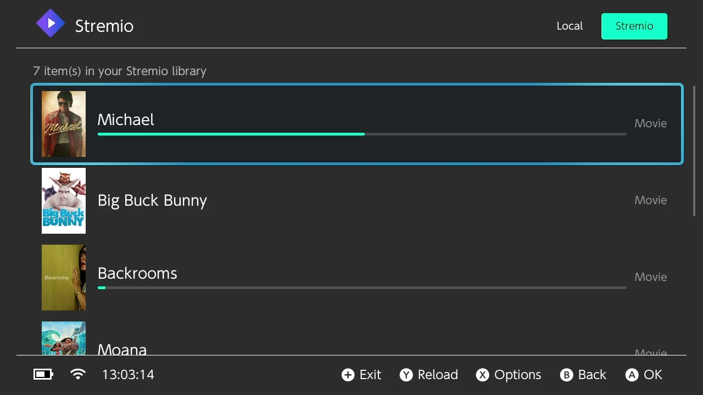
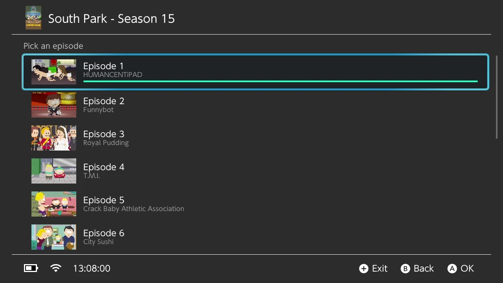
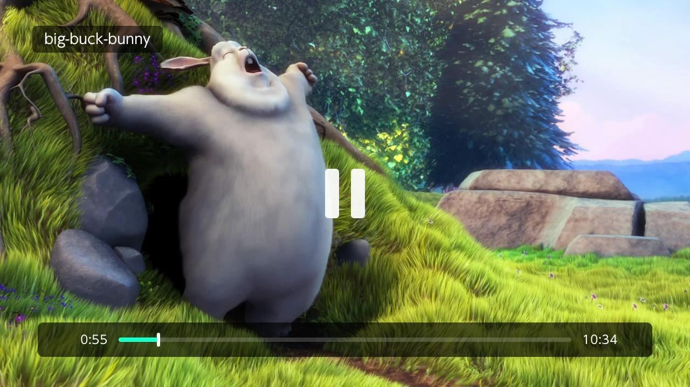

# NX Torrent Player

**NX Torrent Player: Stremio on Nintendo Switch**

A homebrew video player with a BitTorrent engine built in. It does not download
a file and then play it: it downloads the pieces it is about to need, in order,
and starts playing after a few seconds of buffer. Sign in to a Stremio account
and your library, addons and sources are included too.

> Requires a Switch running custom firmware (Atmosphère).

---

## Features

- **Streams torrents** — playback starts on the first pieces; the engine keeps
  downloading ahead of the playhead, and re-centres on it when you seek.
- **Stremio integration** — sign in, browse your library, drill down through
  seasons → episodes → addons → sources, artwork and all.
- **Local torrents** — drop `.torrent` files on the SD card (/switch/NX-torrent-player/torrents/) and play them.
- **borealis** UI: Horizon look, controller-first, touch works too.

## Screenshots

<table>
  <tr>
    <td></td>
    <td></td>
  </tr>
  <tr>
    <td></td>
    <td></td>
  </tr>
</table>

## Install

1. Download `NX-torrent-player.nro` from the [releases](../../releases), or
   build it (below).
2. Put it on your SD card in `/switch/NX-torrent-player/` (create the folder).
3. Launch it from the **Homebrew Menu**.

Updating is done from inside the app (Options → Check on startup is on by
default); it replaces its own .nro and restarts.

## Usage

### Local torrents

Drop `.torrent` files into `sdmc:/switch/NX-torrent-player/torrents/`
(sub-folders are scanned too) and they appear in the **Local** tab with the
torrent's total size. Torrents with no video in them are not listed. If a
torrent holds several videos — a season pack — you get to pick which one.


### Stremio

In the **Stremio** tab, sign in with your email and password. The session is
kept and survives a restart (sign out from Options).

Pick a title → for a show, a season, then an episode → an addon → a source.
Sources are whatever your addons return; only BitTorrent ones can be 
played, and the ones that can't say so up front. 4K sources
are hidden by default — the Switch outputs 1080p docked, so they cost bandwidth
for pixels it cannot show. Turn that off in Options.

## Building

devkitPro is not needed locally — build in the official Docker image, keeping
the build tree in a named volume so it survives between runs:

```sh
# configure once, on a fresh volume
docker run --rm -v st_build:/build -v "$PWD":/project -w /build \
    devkitpro/devkita64:latest sh -c "cmake /project"

# build
docker run --rm -v st_build:/build -v "$PWD":/project -w /build \
    devkitpro/devkita64:latest \
    sh -c "cmake --build . --target NX-torrent-player.nro"

# copy the .nro out of the volume
docker run --rm -v st_build:/build -v "$PWD":/project \
    devkitpro/devkita64:latest sh -c "cp /build/NX-torrent-player.nro /project/"
```

On Windows/Git Bash, prefix each command with `MSYS_NO_PATHCONV=1`, or the
container paths get rewritten. Adding or removing a source file needs a `cmake .`
pass first, since the sources are globbed.

Dependencies come from devkitPro's portlibs (`switch-mpv`, `switch-curl`,
`switch-libwebp`, `switch-mbedtls`…) and are already in the image. borealis is
vendored under `library/`.

## Credits

- [borealis](https://github.com/xfangfang/borealis) — UI framework (vendored,
  with one local patch: see `library/borealis/VENDORED.md`)
- [mpv](https://mpv.io/) — playback
- [libutp](https://github.com/bittorrent/libutp) — uTP transport
- [Stremio](https://www.stremio.com/) — account, library and addon protocol. This
  project is not affiliated with Stremio.
- devkitPro / libnx — toolchain
